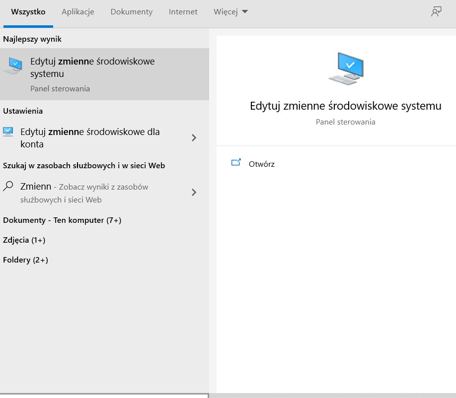
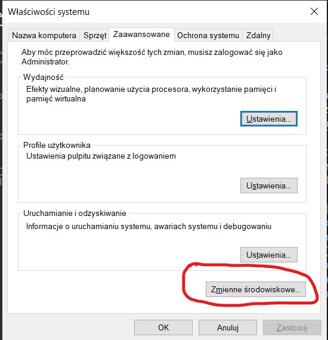
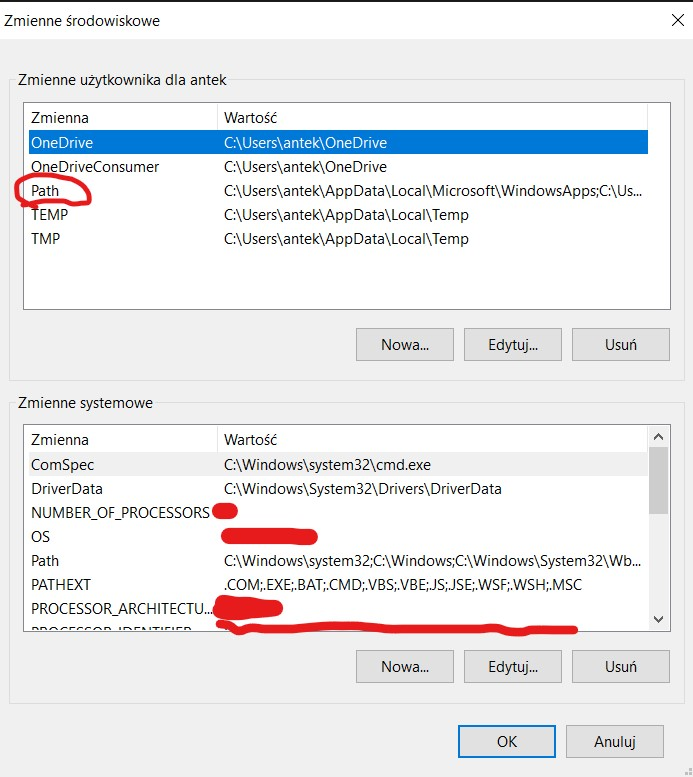
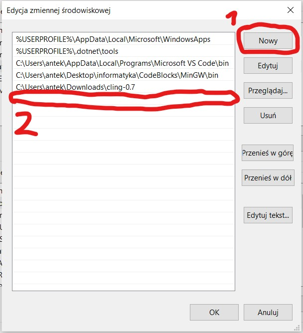

# O Kursie
## Prerekwizyty
# GCC
GCC to najpopularniejszy [kompilator](Słowniczek.md) C++.
Nie będziemy za bardzo używać żadnego [IDE](Słowniczek.md), tylko będziemy korzystać z ... Notatnika i wiersza poleceń.

## Instalacja: <https://gcc.gnu.org>

## Konfiguracja:
Znajdź ścieżkę do pliku `gcc.exe` i skopiuj;

Następnie edytuj zmienną środowiskową PATH (jeśli używasz Linuxa to najpewniej wiesz jak to zrobić :)).

Natomiast jeżeli jesteś na Windowsie, to wyszukaj po lewej stronie pasku zadań frazę `"Zmienne środowiskowe"` i wybierz pierwszą opcję:

Powinno wyskoczyć takie okienko:

Kliknij w opcję zaznaczoną na zdjęciu. Wyskoczy Ci okienko:

 Wybierz zmienną `Path`.

__*WAŻNE!: Tą u góry, w sekcji `Zmienne użytkownika dla <twoja nazwa użytkownika>`!*__ Ta u dołu to zmienna systemowa, a lepiej nie mieszać nic w systemie.

Ze względów bezpieczeństwa zakryłem wartości niektórych zmiennych.

Powinno Ci się otworzyć okienko takie:

Następnie wybierz opcję `Nowy` (1) i wklej ścieżkę do pliku `gcc.exe` w pole, które się podświetli na niebiesko i w którym będzie kursor (2).

Vóila! Możesz kompilować programy uruchamiając cmd i pisząc komendę.

`gcc <nazwa programu>.cpp -o <nazwa pliku wykonywalnego>`!

# Listingi

Kurs będzie się opierać na listingach, czyli "wydrukowanych" fragmentach kodu.
Miałeś już okazję zobaczyć jeden :).

# Moduły
Kurs dzieli się na moduły, każdy o czymś innym.
Z biegiem czasu będą pojawiać się nowe moduły.

# Struktura kursu
Kurs jest zbiorem plików z kodem w języku Markdown, który jest przetwarzany do HTML i jest wykorzystywany do tworzenia dokumentacji.
Razem z tymi plikami pobrałeś zdjęcia, które są dodane do plików lekcji, oraz [Słowniczek pojęć, które niekoniecznie znałeś wcześniej](Slowniczek.md)

---
###### [&lt;=](0.1.Spis_tresci.md) Poprzednia lekcja&nbsp;&nbsp;&nbsp;&nbsp;&nbsp;&nbsp;&nbsp;&nbsp;&nbsp;&nbsp;&nbsp;&nbsp;&nbsp;&nbsp;&nbsp;&nbsp;&nbsp;&nbsp;&nbsp;&nbsp;&nbsp;&nbsp;&nbsp;&nbsp;&nbsp;&nbsp;&nbsp;&nbsp;&nbsp;&nbsp;&nbsp;&nbsp;&nbsp;&nbsp;&nbsp;&nbsp;&nbsp;&nbsp;&nbsp;&nbsp;&nbsp;&nbsp;&nbsp;&nbsp;&nbsp;&nbsp;Następna lekcja [=&gt;](Wstep/0.3.O_Cpp.md)
###### [Spis treści](Wstep/0.1.Spis_tresci.md.md)&nbsp;&nbsp;&nbsp;&nbsp;&nbsp;&nbsp;&nbsp;&nbsp;&nbsp;&nbsp;&nbsp;&nbsp;&nbsp;&nbsp;&nbsp;&nbsp;&nbsp;&nbsp;&nbsp;&nbsp;&nbsp;&nbsp;&nbsp;&nbsp;&nbsp;&nbsp;&nbsp;&nbsp;&nbsp;&nbsp;&nbsp;&nbsp;&nbsp;&nbsp;&nbsp;&nbsp;&nbsp;&nbsp;&nbsp;&nbsp;&nbsp;&nbsp;&nbsp;&nbsp;&nbsp;&nbsp;&nbsp;&nbsp;&nbsp;&nbsp;&nbsp;&nbsp;&nbsp;&nbsp;&nbsp;&nbsp;&nbsp;&nbsp;&nbsp;&nbsp;&nbsp;&nbsp;&nbsp;&nbsp;&nbsp;&nbsp;&nbsp;&nbsp;&nbsp;&nbsp;&nbsp;&nbsp;&nbsp;&nbsp;[O C++](Wstep/0.3.O_Cpp.md)
---